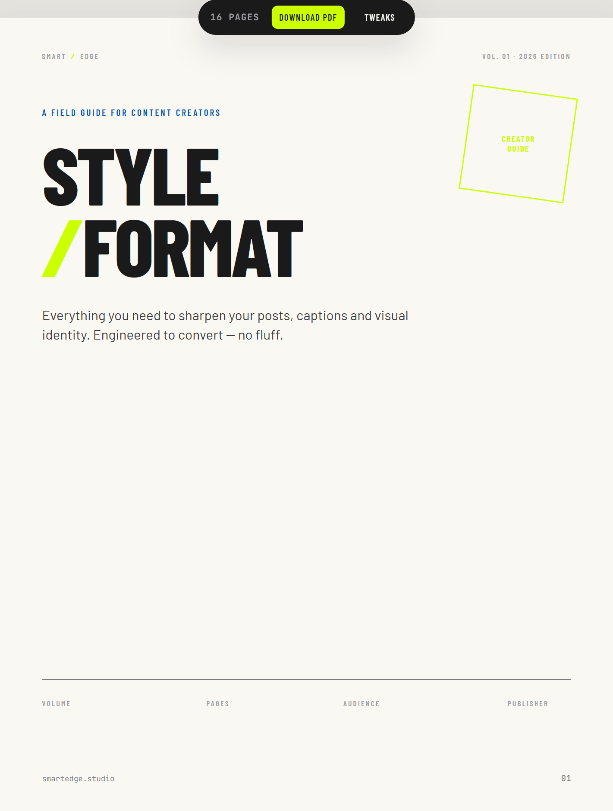

# Creator Style Guide

A digital style and formatting guide for SMART/EDGE content creators. Print-ready (US Letter) and scrollable on screen.

## What's inside

A 16-page guide covering brand colors, typography, voice and tone, layout rules, and do's and don'ts for creators producing content under the SMART/EDGE brand.

## Viewing the guide

**Live version:** https://smartedgedm.github.io/creator-style-guide/

Or open `index.html` locally in any modern browser. No build step, no dependencies.

## Project structure
creator-style-guide/
├── assets/          Brand logos, favicon, hero image
├── styles/
│   ├── brand.css    Design tokens: colors, type, spacing, motion
│   └── guide.css    Guide-specific layout and print styles
└── index.html       The guide itself
## Printing to PDF

Click the "Download PDF" button in the toolbar, or use your browser's print dialog (Ctrl+P). The layout is optimized for US Letter portrait.

## Brand

SMART/EDGE. Where Great Design Clicks.

## License

Creator Style Guide © 2026 by SMART/EDGE is licensed under [CC BY-NC-ND 4.0](https://creativecommons.org/licenses/by-nc-nd/4.0/).

You're welcome to view and share this work with attribution. Commercial use, modification, or redistribution of modified versions is not permitted without explicit written permission.

For licensing inquiries, contact: hello@smartedgedm.com